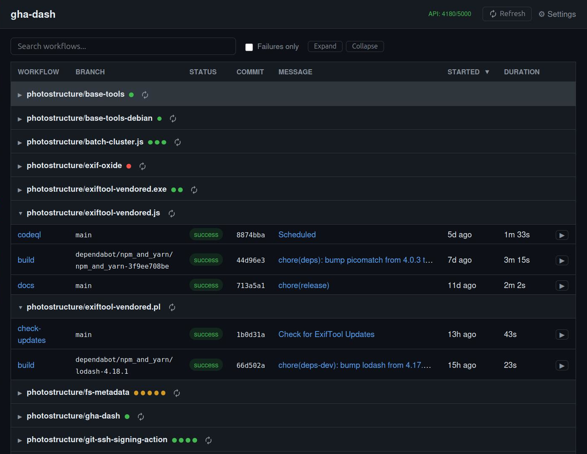

# gha-dash

Local web dashboard for GitHub Actions. See workflow status across all your repos at a glance.

**Only prerequisite:** an authenticated [`gh` CLI](https://cli.github.com/).

```bash
npx gha-dash
```

Opens `http://localhost:3131` in your browser. All settings are configurable from the UI.

| Flag               | Description                          |
| ------------------ | ------------------------------------ |
| `--port N`, `-p N` | Use a different port (default: 3131) |
| `--no-open`        | Don't auto-open browser              |

## What it does

- Shows workflow runs in a sortable, searchable table grouped by repo
- Auto-refreshes via background polling
- Collapsible repo groups with color-coded status dots
- Filter to failures only with one click
- Trigger `workflow_dispatch` workflows with typed input forms
- Dark mode (automatic via OS preference)
- Works immediately — discovers your repos on first run, no config needed

## Screenshot



## Configuration

Config lives at `~/.config/gha-dash/config.json` (Linux/macOS) or `%APPDATA%/gha-dash/config.json` (Windows).

| Field             | Default          | Description                                                |
| ----------------- | ---------------- | ---------------------------------------------------------- |
| `repos`           | `[]`             | Repos to monitor. Empty = discover all your repos.         |
| `refreshInterval` | `3600`           | Seconds between API refreshes.                             |
| `rateLimitFloor`  | `500`            | Stop refreshing when API calls remaining drops below this. |
| `rateBudgetPct`   | `50`             | Max percentage of rate limit to use per refresh cycle.     |
| `hiddenWorkflows` | `["dependabot"]` | Hide workflows whose name contains any of these.           |
| `port`            | `3131`           | Server port.                                               |

Use the Settings page to add/remove repos and configure options interactively.

## Rate limiting

gha-dash caches aggressively to stay within GitHub's 5,000 requests/hour limit:

- Default branch names are cached permanently (fetched once per repo)
- Workflow data is cached to disk — restarts don't refetch
- Refreshes skip entirely when remaining calls are below the floor
- When budget is tight, repos are refreshed in rotating batches

## Development

```bash
git clone https://github.com/photostructure/gha-dash
cd gha-dash
npm install
npm run dev       # starts Express (API on :3131) + Vite (UI on :5173)
npm test          # vitest
npm run build     # production build → dist/
```

`npm run dev` opens `http://localhost:5173` automatically. The Vite dev
server proxies API requests to Express on port 3131. In production
(`npx gha-dash`), everything is served from a single port.

## Acknowledgments

Inspired by [github-action-dashboard](https://github.com/chriskinsman/github-action-dashboard)
by Chris Kinsman.

## Sponsor

This project is sponsored by [PhotoStructure, Inc.](https://photostructure.com)

## License

[Apache-2.0](LICENSE)
